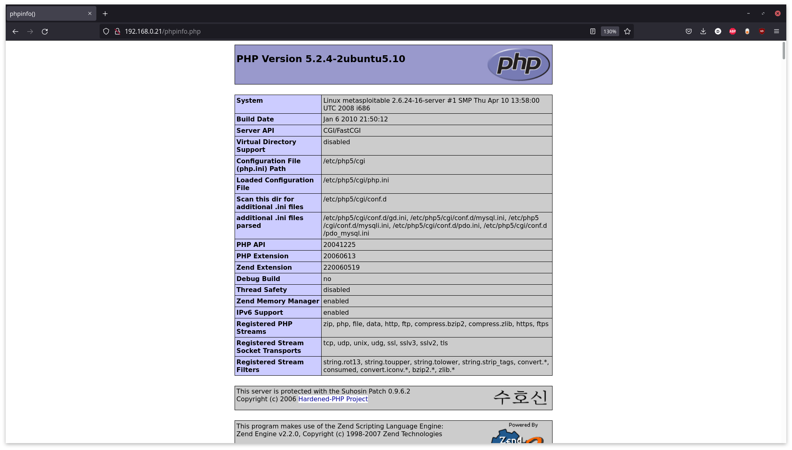

# **Guía de PenTesting**

El presente documento tiene como función el ser una guía del proyecto realizado con el objetivo propósitos de mostrar las generalidades del PenTesting al igual que las herramientas usadas y el empleo de estas mismas.

## **Introducción**

## **Preparación del Laboratorio**

Lo primero a realizar para la realización del desarrollo de la presente proyecto está en la preparación del entorno de trabajo, o laboratorio de PenTesting. En este caso, este entorno estará basado en máquinas virtuales las cuales representarán nuestras máquinas objetivo.

### Máquinas Virtuales

Para el desarrollo del presente proyecto, estaremos trabajando con un total de 2 máquinas virtuales, las cuales usaremos para la demostración de las diferentes etapas del PenTesting.

Estas nos permitiran trabajar en un ambiente controlado sin la necesidad de estar exponiendo nuestro equipo a redes externas, o correr el riesgo de afectar algún computador o red de un tercero.

#### VMWare

Para esta ocasión, estaremos usando la VMWare como nuestro Hypervisor para la creación de todas las máquinas virtuales en las que vamos a estar trabajando. Como configuraciones generales, y para los propósitos del desarrollo de este proyecto, la única opción verdaderamente obligatoria es la selección de la configuración de red en puente (O Bridged Connection). El resto de las configuraciones pueden dejarse al mínimo o según estas lo requieran.

<p align="center">
    
</p>

#### Metasploitable2

Metasploitable2 es una máquina virtual de Linux intencionalmente vulnerable utilizada para el entrenamiento de seguridad al igual que las pruebas de diferentes herramientas para realizar PenTesting.

Para nuestros propósitos de la demostración de las fases del PenTesting, en especial la identificación de vulnerabilidades, nos resulta especialmente útil debido las evidentes vulnerabilidades que estas presenta.

Podemos encontrar la imagen de esta máquina en se siguiente [vínculo](https://sourceforge.net/projects/metasploitable/files/Metasploitable2/). Tras descargar y extraer, sólo debemos agregar el archivo `.vmx` a nuestra instalación de VMWare.

#### Kioptrix Level 1

Al igual que Metasploitable2, Kioptrix es una máquina virtual de Linux que presenta vulnerabilidades de manera intencional. Es por esto que nos interesa el trabajar con esta para el cumplimiento de los objetivos del desarrollo del presente proyecto.

La imagen de esta máquina puede ser encontrada en el siguiente [vínculo](https://www.vulnhub.com/entry/kioptrix-level-1-1,22/). Tras descargar y extraer, sólo debemos agregar el archivo `.vmx` a nuestra instalación de VMWare.

## **Etapas del PenTesting**

### **Fase de Recolección de Información**

La recolección de información es de las fases más importantes en cuanto al PenTesting se refiere. Esto se debe a que, como es de esperarse, es aquí es donde se sientan las bases de lo que luego serían las pruebas de penetración a realizar.

#### **Recolección Pasiva**

La recolección pasiva dentro del PenTesting se refiere a la recuperación de Información del objetivo a atacar sin verdaderamente realizar un contacto _directo_. Esto puede verse principalmente en la identificación de las características principales de la página y la información que esta provee de manera pública (OSINT).

Este tipo de recolección de datos, es principalmente usada para realizar PenTesting a aplicativos web o servidores `http` o `https`. Esto se debe a que, en el caso de las redes en las que queramos realizar PenTesting, la información abierta al público sobre la red, puede ser poca o nula en algunos cosas.

Dentro de las herramientas que podemos usar están `theharvester`, `subdomain3`, `whois` al igual que motores de búsqueda como google e incluso, en el caso de aplicativos web, las páginas en sí.

```bash
# Estos son algunos de los comandos que nos pueden interesar para realizar la recolección
# de información pasiva de algunas páginas web
python brutedns.py -d google.com -s high -l 5
```

[Resultado de la ejecución](https://gist.github.com/MrDahaniel/9b71389beb3bd22e689a4a937cc008ed)

#### **Recolección Activa**

La recolección activa de datos ya trata como tal de la recolección de información a partir de la interacción con el objetivo de manera directa a través de la red. Este tipo de recolección se puede realizar a partir de escaneos de red usando herramientas como `nmap` o `nessus` en el caso de redes o `nikto` en el caso de páginas web.

Lo primero sería el realizar una inspección general de los dispositivos dentro de la red, esto puede hacerse de varias maneras:

```sh
# Usando arp-scan
arp-scan --interface=enp3s0 --localnet
# usando nmap
nmap -sn 192.168.0.0/24
```

[Resultado de la ejecución](https://gist.github.com/MrDahaniel/fa3c3d5ffd3b7d6d38ce5d5e7bf91aae)

##### Staging

Tras haber identificado la `ip` objetivo, podemos es posible realizar un análisis más detallado del dispositivo y qué información está al alcance de nuestras manos. En este caso, se realizará el análisis de 2 `ips` objetivo.

Lo primero, usando `nmap`, y pasando la opción `-p-` como bandera, lo que indica que queremos hacer un recorrido de todos los puertos; podemos realizar el _staging_ del dispositivo con el fin de, en el momento de realizar la inspección más a fondo, haya un mejor rendimiento en términos de ejecución.

```sh
# Escaneo de Metasploitable2
nmap -T4 -p- 192.168.0.17
# Escaneo de Kioptrix L1
nmap -T4 -p- 192.168.0.21
```

[Resultado de la ejecución](https://gist.github.com/MrDahaniel/0e80bf474dd094928fdf427487d5c0c3)

##### Deep Searching

Ahora, partiendo de la información que nos proporcionó el escaneo general de todos los puertos, podemos realizar un escaneo más a profundidad de cada uno de los puertos listados o a los puertos que consideremos relevantes o interesantes.

Algunos de los puertos seleccionados, o de interés general para nuestras aplicaciones, está en la búsqueda de los puertos abiertos relacionados con servicios SSH, o conexión entre máquinas; sistemas de archivos, como Samba u otros; servidores web, o servidores http; e incluso motores de búsqueda como lo pueden ser MySQL o PostgreSQL.

Empecemos con los puertos relevantes para la máquina de Metasploitable2.

```sh
# Escaneo a profundidad de Metasploitable2
nmap -A -p22,23,53,80,139,445,514,3306 -T4 192.168.0.17
```

[Resultado de la ejecución](https://gist.github.com/MrDahaniel/8e0feb42021d3a77b0262c8900c84762#file-nmap-net-scan-metasploit2)

Tras la ejecución de nuestro escaneo, se nos presentan varios detalles importantes para nuestra actual tarea. Podemos ver versiones de OpenSSH, que el puerto que está corriendo Telnet está abierto, la existencia de un servidor web de Apache al igual que su versión actual, la existencia de Samba al igual que su versión actual y, finalmente, la existencia de un servidor de MySQL 5.0.51a y otros protocolos.

Una de las cosas que podemos hacer es realizar la inspección de, en este caso, el servidor apache que está ejecutando para ver si podemos encontrar algún tipo de información relacionada con la configuración de esta u otras características del sistema. Visitando con nuestro navegador de preferencia la `ip` de nuestra máquina de Metasploitable2, se nos presenta la siguiente pantalla.

<p align="center">
    
</p>

Explorando un poco, podemos ver la algunos de los menús que se nos presentan. Entre estos está el menú de Administrador `php` al igual que algunas de las páginas web que están montadas dentro del servidor.

<p align="center">
    
    
</p>

Usando `nikto`, podemos ver más información relacionada con la página web que está _hosteando_ la máquina de Metasploitable2.

```sh
# Escaneo del servidor http
nikto -h 192.168.0.17
```

[Resultado de la ejecución](https://gist.github.com/MrDahaniel/9254909c6131a83d1a8492ca725c0039#file-nikto-metasploitable2)

Esto nos presenta con más información sobre la versión del servidor al igual que más urls que pueden considerarse interesantes. Cosas como que, revisando `/phpinfo.php`, podemos ver de manera abierta la configuración casi que completa del servidor al igual que muchas de las librerías que está usando.

<p align="center">
    
</p>

Ahora revisemos los puertos de la máquina de Kioptrix.

```sh
# Escaneo a profundidad de Kioptrix L1
nmap -A -p22,80,111,139,443,1024 -T4 192.168.0.21
```

[Resultado de la ejecución](https://gist.github.com/MrDahaniel/8e0feb42021d3a77b0262c8900c84762#file-nmap-net-scan-kioptrix)

De esto se esto, al igual que con la máquina anterior, nos presenta con más información sobre el sistema la cual nos puede ser útil más adelante. La existencia de `OpenSSH` versión 2.9p2; un servidor apache, versión 1.3.20 y `mod ssl` 2.8.4 que aún tiene su página de Test activada; los diferentes puertos de trabajo de rcpbind; y finalmente, la existencia de `Samba` son algunos de los resultado esta operación.

Podemos revisar el puerto `139` relacionado con `Samba` y los diferentes grupos de trabajo presentes en este. Probemos realizar una simple conexión al cliente de `Samba`.

```sh
# Nos conectamos al cliente de Samba
smbclient -L 192.168.0.21
```

[Resultado de la ejecución](https://gist.github.com/MrDahaniel/06918ee97091209042ef15d16515a2e8)

De esto, y sin la contraseña del cliente, podemos ver la existencia de algunos de los Sharenames a los cuales podemos tratar acceder. Intentando realizar la conexión usando `smbclient 192.168.0.21\ADMIN$` o `smbclient 192.168.0.21\IPC$`, aunque no nos permite avanzar más de ahí, nos muestra que `IPC$` no tiene contraseña.

Tras revisar, y anotar, todo lo que nos parezca interesante, y consideremos que se tiene suficiente información relacionada con el sistema, podemos pasar a la siguiente fase del PenTesting.

### **Fase de Búsqueda de Vulnerabilidades**

Tras la identificación de algunos de los recursos disponibles durante la fase de la recolección activa de información. Se debe, ahora, buscar las posibles vulnerabilidades de las máquinas a las cuales les estamos realizando el PenTesting. Es a partir de las vulnerabilidades identificadas durante esta fase sobre la cual construiremos nuestro informe final para que, los responsables de la seguridad de la red, puedan realizar las correcciones necesarias para mitigar las vulnerabilidades encontradas.


### **Fase de Explotación de Vulnerabilidades**

### **Fase Post-explotación**

### **Fase de Informe**
