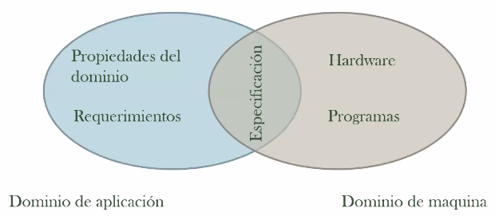
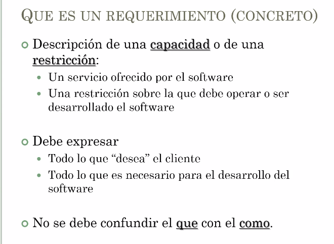

# Ingeniería de Software I

## Actividades del Desarrollo del Software

-   Desarrollo efectivo del Software dentro de los costos y cronograma
-   Basada en un enfoque sistemático que usa técnicas y herramientas apropiadas
-   Sigue un proceso predeterminado
    -   En estos casos, nos referimos a una serie de actividades las cuales deben cumplirse para poder realizar un objetivo.

### Actividades

-   Ingeniería de requerimientos
    -   Se determinan las necesidades del cliente al igual que el alcance del software basados en las limitaciones de presupuesto y
-   Diseño
    -   Se definen las características y el como serán las interacciones que van a desarrollar.
    -   El diseño es la parte _ingeneríl_. Es en el diseño en el cual se identifican problemas o partes faltantes.
-   Implementación
    -   Es en este parte donde se realiza el desarrollo como tal de la solución diseñada.
-   Validación y Verificación
    -   Se determina si el software funciona de manera correcta al igual que la búsqueda y solución de errores.
-   Mantenimiento
    -   Se busca que se mantenga la solución desarrollada para el cliente.

### Ciclo de vida

El ciclo de vida, en el software, se refiere a la línea de tiempo de su _nacimiento_ hasta incluso después de que este _muere_.
Esta puede verse como una línea de tiempo en la que se pasa por cada una de las actividades.

## Ingeniería de Requerimientos

Es en esta parte en la cual se determinan las necesidades de los clientes para el desarrollo del software. Es necesario identificar correctamente las necesidades del software y así poder evitar generar sobrecostos más adelante en el caso de necesitar realizar correcciones en el software.

> Se puede tener un software perfecto pero si no hace lo que tiene que hacer, ese software no sirve para nada.

## Diseño de Software

Está compuesta de varios componentes y multiples actividades las cuales son necesarias para realizar el diseño de un software.

-   Diseño arquitectural
-   Diseño de interfaces
-   Diseño de componentes
-   Estructuras de datos
-   Especificación abstracta
-   Diseño de algoritmos

Tras la realización de las actividades, tendremos diferentes productos o resultados. Es a partir de estas salidas que se realizará el desarrollo del software.

-   Estructura del sistema
-   Especificación de interfaces
-   Especificación de datos
-   Especificación del software
-   Especificación de componentes
-   Especificación de algoritmos

## Implementación

Es el momento en que se realiza como tal el desarrollo del software. Es en esta parte en la cual, basado en el diseño determinado, se realiza la creación del software con el uso de diferentes herramientas.

# Ingeniería de Requerimientos

La definición de requerimientos es una de las partes principales dentro del ciclo de vida del desarrollo. Es en esta parte en la cual se realiza la definición de las necesidades del cliente.

## Definir requerimientos

Esto se define como una serie de actividades la cual, al final del caso, terminaría con la definición de las necesidades del cliente las cuales deberían ser resueltas con el desarrollo de la solución.

###

### Stakeholders

En este caso se refiere principalmente a las personas que tienen algún interés hacia el software en términos generales. Las personas que están involucradas, normalmente, van desde los administradores hasta los usuarios, clientes y los mismos desarrolladores.

Todos los Stakeholders, en la gran cantidad de los casos, van a tener puntos de vista diferentes en el como deben realizar las cosas dentro del desarrollo.

### Impacto de los requerimientos

#### Legales

Se refiere a la base legal, o los contratos, entre el cliente y la empresa de desarrollo. Es desde de donde se trabaja. Si está mal definido, puede afectar el desarrollo final del software.

#### Económicos

El costo asociado con requerimientos errados o no tenidos en cuenta. Simpre tiene un precio no tener en cuenta algo.

#### Sociales

El como una mala definición puede afectar a las personas. En todo sentido.

### Propiedades de los requerimientos

#### Problemas posibles

Pueden existir muchos problemas por los cuales pueden presentarse problemas más adelante. Ambiguedad, inconsistencias, malas estructuras, que no sea legible o comprensible, o hayan sobre-especificaciones, _cháchara_ o redundancias.

### Dificultades para cumplir con las propiedades de los requerimientos

-   Los clientes casi nunca siempre no saben lo que quieren.
-   Los deseos y necesidades de los clientes evolucionan.
-   Existen conflictos internos.
-   Ciertos problemas no son tan fáciles de entender.
-   Falta de entendimiento del problema.

### Resumen de todo sobre requerimientos

