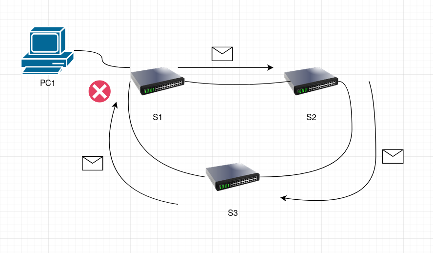
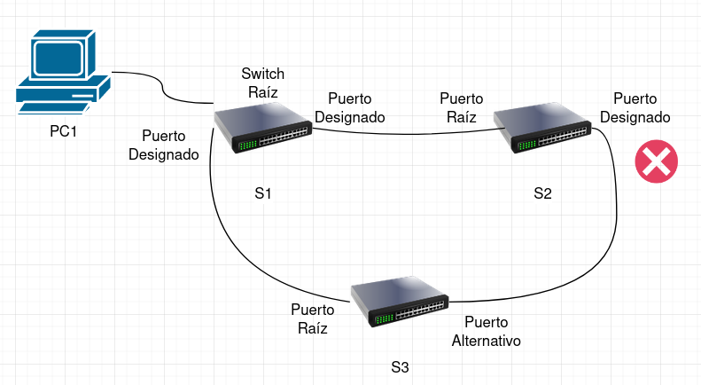

## Protocolo STP: Técnica Del Árbol De Expansión

> Desarrollado por: Daniel David Delgado Cervantes - 2182066

#### Propósito

En términos sencillos, el protocolo de árbol de expansión, o STP por sus siglas en inglés, se trata de un protocolo de red usado para evitar "bucles" cuando existen conexiones redundantes entre switches. Esto se realiza con el fin de evitar tener mensajes repetidos mandado por diferentes caminos lo cual puede generar problemas en términos de interrupción de la comunicación entre equipos.

#### Operación

La manera en la que STP opera con el fin de evitar los bucles en las redes es a partir del bloqueo de ciertos puertos. Estos puertos bloqueados evitan que se vuelvan a enviar mensajes en bucle entre los diferentes switches presentes en una red.

En este diagrama podemos ver que un mensaje ha sido mandado desde el PC1. Este ha llegado a `S1` y ha sido mandado únicamente a `S2` ya que la conexión directa con `S3` tiene el puerto bloqueado y no puede enviar ni recibir mensajes. El mensaje, al llegar a `S2`, será enviado a `S3` y luego enviado a `S1`. Este último no llegará a `S1` debido al bloqueo que este presenta en el puerto que lo comunica con `S3`. De esta manera, se ha evitado un bucle en la red.

#### Funciones

En el caso de STP, los puertos cumplen diferentes funciones. Dichas funciones son determinadas a partir del cálculo realizado durante la ejecución del algoritmo STA.

En este caso, S1 fue establecido por el algoritmo como la raíz. Esto quiere decir que es a partir de este switch por el cual se determinará la función de cada uno de los otros puertos. Siendo así, los puertos de nuestra raiz serán definidos como _puertos designados_ y los que puertos de otros switches conectados a nuestra raíz, _puertos raíz_. Finalmente, en el caso de que existan rutas redundantes, el switch con el puerto bloqueado definirá dicho puerto como un _puerto alternativo_.

#### Mensajes

Los mensajes usados por nuestro protocolo para la determinación de las funciones de los distintos puertos de cada uno de los switches presentes en la red son BPDU. BPDU, o _Bridge Protocol Data Unit_ por sus siglas en inglés, en esencia contiene la información relevante para nuestro protocolo de árbol. En esta BPDU, está presente la dirección MAC del puerto de origen.

De igual manera, existen 2 clases, o tipos, de BPDU. La BPDU de configuración, usada por los switches para realizar la configuración inicial el protocolo; y la BPDU TCN, la cual es usada a manera de notificación para el switch raíz de los cambios realizados en la topología de la red. Los BPDU son enviados, por defecto, cada 2 segundos.

#### Algoritmo

El algoritmo de árbol de expansión funciona de manera relativamente sencilla y puede verse como una serie de pasos que realiza la red en el caso de la configuración inicial.

1. Se establecen todos los switches dentro de la red como la **raíz**.
2. Cada uno de los switches dentro de la red envían BPDU de configuración por cada uno de los puertos.
3. En el momento de recibir una respuesta, se realiza la comparación entre la nueva configuración recibida. En el caso de que sea mejor, se guardará la configuración.
    - Puntos de comparación de la configuración
        - Un ID más pequeño
        - Un mismo ID pero con una mejor distancia
        - El ID y la distancia son iguales, pero el switch que envió el mensaje tiene un menor ID
4. Este mismo proceso se repite una `n` cantidad de veces hasta que exista una única raíz dentro de la red. De igual manera, se van bloqueando los puertos que presenten bucles en ellos.

#### Funcionamiento

Teniendo la red con su switch raíz ya definida, y los puertos respectivos bloqueados, no existe problema alguno en términos de la comunicación entre los diferentes dispositivos presentes en la red. Ahora, en el caso de que haya un cambio en la topología dentro de la red, se utilizarán los puertos alternativos en cuanto se pueda con el fin de mantener la operación de la red.

#### Características

Algunas de las características principales de STP están dadas por las guardias de Raíz, guardias de bucles, guardias de BPDU, y guardias de EtherChannel. Todas estas son protecciones en contra de malas configuraciones al igual que posibles problemas en cuanto a la topología de redes como lo es el caso de la existencia de bucles en estas. Son gracias a estas características por las cuales este protocolo es bastante importante.

#### Aplicaciones

En cuanto a las aplicaciones de este protocolo, como fue descrito anteriormente, está en la posibilidad asegurar el correcto funcionamiento de las redes al igual que evitar problemas de saturación de la red debido a la existencia de bucles de mensajes.

#### Referencias

-   Peterson, L. L., & Davie, B. S. (2012). Internetworking. Computer - [Link](https://sci-hub.se/10.1016/B978-0-12-385059-1.00003-X)
-   Cisco. (s.f.). Protocolo de árbol de expansión. - [Link](https://www.cisco.com/c/es_mx/tech/lan-switching/spanning-tree-protocol/index.html)
-   Cisco. (s.f.). Security Features on Switches. - [Link](https://www.ciscopress.com/articles/article.asp?p=1181682&seqNum=5)
-   CCNA desde cero. (s.f.). Funcionamiento del Protocolo de Árbol de Expansión (STP) - [Link](https://ccnadesdecero.es/protocolo-arbol-expansion-stp/)
-   Watchguard. (s.f.). Acerca del Protocolo de Árbol de Expansión - [Link](https://www.watchguard.com/help/docs/fireware/12/es-419/Content/es-419/networksetup/spanning_tree_protocol.html)
